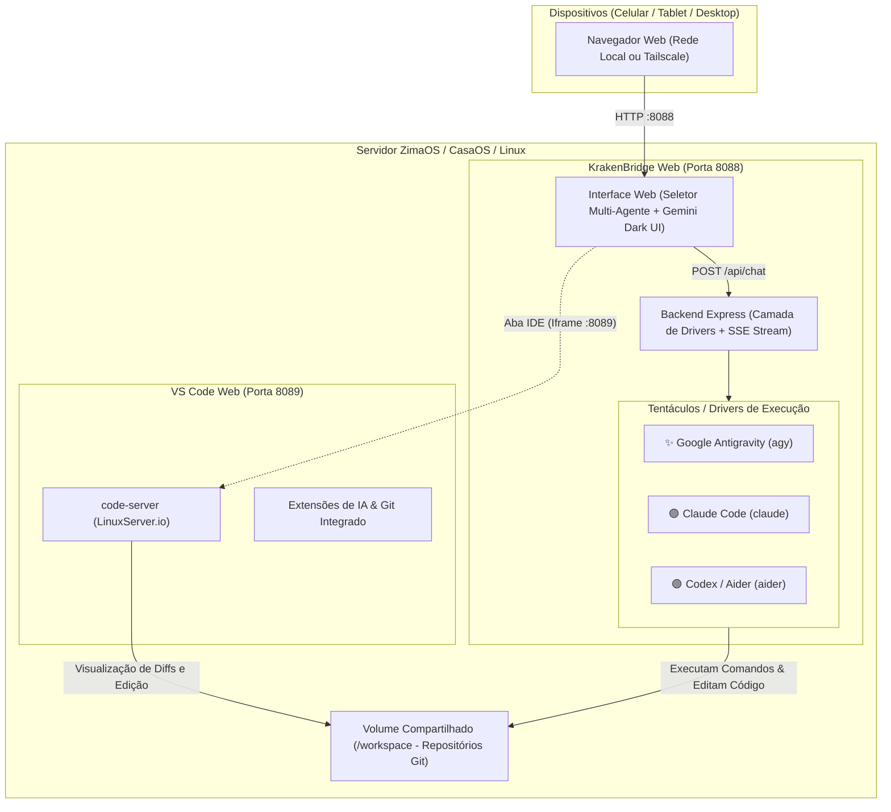

<div align="center">

# 🦑 KRAKENBRIDGE WEB
### 🌉 Multi-Agent Autonomous AI Bridge & Web IDE
**Google Antigravity • Claude Code • OpenAI Codex / Aider • VS Code Web**

[](https://www.zimaspace.com/zimaos)
[](https://casaos.io/)
[](https://www.docker.com/)
[](https://opensource.org/licenses/MIT)

</div>

---

## 💡 O que é o KrakenBridge Web?

O **KrakenBridge Web** é a ponte definitiva que transforma os agentes de programação autônomos de terminal (**Google Antigravity**, **Claude Code**, **OpenAI Codex / Aider**) em uma plataforma de desenvolvimento web completa para **ZimaOS, CasaOS, Homelabs ou VPS**.

Assim como o mítico **Kraken**, a aplicação controla múltiplos motores e ferramentas através de tentáculos sincronizados:
1. **🤖 Modo Agente com Logs Reais de Terminal:** Acompanhe a execução do agente em tempo real via Server-Sent Events (SSE), contadores de *thinking tokens* e **cartões colapsáveis com os comandos de terminal executados e sua saída real (`stdout`/`stderr`)**.
2. **💻 Modo IDE Embutido:** O **VS Code oficial para navegador (`code-server`)** roda no mesmo ambiente. Alterne instantaneamente entre o chat e o editor com um clique na aba **[IDE]**.
3. **🐙 Suporte Multi-Motor:** Selecione no topo da interface qual cérebro deseja acionar:
   * **✨ Google Antigravity (`agy`)**
   * **🟣 Anthropic Claude Code (`claude`)**
   * **🟢 OpenAI Codex / Aider (`aider`)**
4. **🔄 Workspace Unificado:** Agentes e VS Code compartilham o mesmo volume (`/workspace`), permitindo inspecionar *git diffs* e novos arquivos no mesmo segundo em que a IA os cria.

---

## 🏗️ Arquitetura



---

## 🚀 Instalação com 1 Clique no ZimaOS / CasaOS

O [`docker-compose.yml`](docker-compose.yml) do KrakenBridge Web já conta com os metadados oficiais **`x-casaos`**:

1. Acesse o painel do seu **ZimaOS** (`http://zimaos.local` ou IP do servidor).
2. Na App Store, clique no botão **"+"** (Instalar App) no canto superior.
3. Escolha **"Custom Install"**.
4. Clique no ícone de importar no canto superior direito (**Import Compose**).
5. Cole o conteúdo de [`docker-compose.yml`](docker-compose.yml).
6. Ajuste os caminhos se necessário (ex: seu diretório de projetos em `/DATA/Projetos`).
7. Clique em **Install**.

O app **KrakenBridge Web** e o **VS Code** aparecerão na sua tela inicial!

---

## 🐳 Instalação Manual com Docker Compose (Ubuntu / Debian / VPS)

```bash
# 1. Clone o repositório
git clone https://github.com/SEU-USUARIO/krakenbridge-web.git
cd krakenbridge-web

# 2. Configure suas variáveis de ambiente
cp .env.example .env
nano .env

# 3. Execute o setup de permissões e pastas
chmod +x scripts/*.sh entrypoint.sh
./scripts/setup.sh

# 4. Inicie os serviços
docker compose up -d
```

Acessos:
* **KrakenBridge Web (Agente & IDE):** `http://IP-DO-SERVIDOR:8088`
* **VS Code Web direto:** `http://IP-DO-SERVIDOR:8089/?folder=/workspace`

---

## ⚙️ Variáveis de Ambiente (`.env`)

| Variável | Padrão | Descrição |
|:---|:---|:---|
| `WORKSPACE_PATH` | `/DATA/Projetos` | Caminho no host onde ficam seus repositórios de código. |
| `CODE_SERVER_CONFIG` | `/DATA/AppData/code-server-config` | Pasta onde as configurações e extensões do VS Code ficam salvas. |
| `KRAKEN_CONFIG_PATH` | `/DATA/AppData/krakenbridge/config` | Histórico e credenciais persistentes dos CLIs. |
| `WEB_PORT` | `8088` | Porta da interface web do KrakenBridge. |
| `IDE_PORT` | `8089` | Porta do VS Code Web (`code-server`). |
| `GEMINI_API_KEY` | *(opcional)* | Chave de API Google Gemini (para Antigravity). |
| `ANTHROPIC_API_KEY` | *(opcional)* | Chave de API Anthropic (para Claude Code). |
| `OPENAI_API_KEY` | *(opcional)* | Chave de API OpenAI (para Codex / Aider). |
| `PUID` / `PGID` | `1000` | UID e GID do seu usuário no host. |

---

## 🛠️ Resolução de Problemas Comuns (*Gotchas*)

### 1. Subpastas de Projetos não aparecem no Git do VS Code
* **Motivo:** O VS Code escaneia repositórios com profundidade 1 por padrão (`git.repositoryScanMaxDepth: 1`).
* **Solução:** O script `./scripts/setup.sh` copia automaticamente o arquivo `config/vscode-settings.json` para `/workspace/.vscode/settings.json`, definindo `"git.repositoryScanMaxDepth": 5`.

### 2. Erro de `dubious ownership` do Git
* O contêiner e o script de setup configuram globalmente:
  ```bash
  git config --global --add safe.directory "*"
  ```

---

## 📱 Acesso Remoto com Tailscale

Se você utiliza o **Tailscale** no seu servidor:
* Acesse de qualquer lugar do mundo pelo IP da sua tailnet:
  * `http://100.x.y.z:8088`
* No iPhone ou Android, use a opção **"Adicionar à Tela de Início"** no navegador para ter uma experiência de aplicativo nativo (PWA) conectado direto ao seu homelab!

---

## 📄 Licença

Distribuído sob a licença **MIT**. Veja [`LICENSE`](LICENSE) para mais informações.
Feito com 🦑 pela comunidade de desenvolvedores e entusiastas de Homelab.
